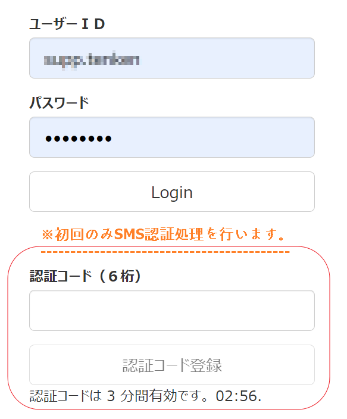

# 基本操作編



## レセプトの準備

直近の電子レセプトを準備します。複数の過去レセプトがあればより望ましいです。 院内処方であれば提出済のレセプトを、院外処方の場合には処方箋の内容を含んだ チェック用のレセプトをUSBメモリーあるいはハードディスクなどにいれて用意し てください。

注：チェック用レセプトの作成法はレセコンのサポート業者にご相談ください。 レセコンの機種によってはチェック用レセプトが作成できない場合があります。

## Google Chrom ブラウザ   [ダウンロード](https://www.google.co.jp/chrome/?brand=FDKM&gclid=Cj0KCQjwrsGCBhD1ARIsALILBYr0Moo0gPVqjheS9amL9joYxGxDtFBIwvu4vhcHOzXMZCSC0bZjH-AaAmjkEALw_wcB&gclsrc=aw.ds)

{: height="200"}

## ログイン　[https://owlstart.owl-checker.com/login](https://owlstart.owl-checker.com/login)

ID、パスワードを入力して、［Login］をクリックします。

※最初のみSMS認証処理を行います。

