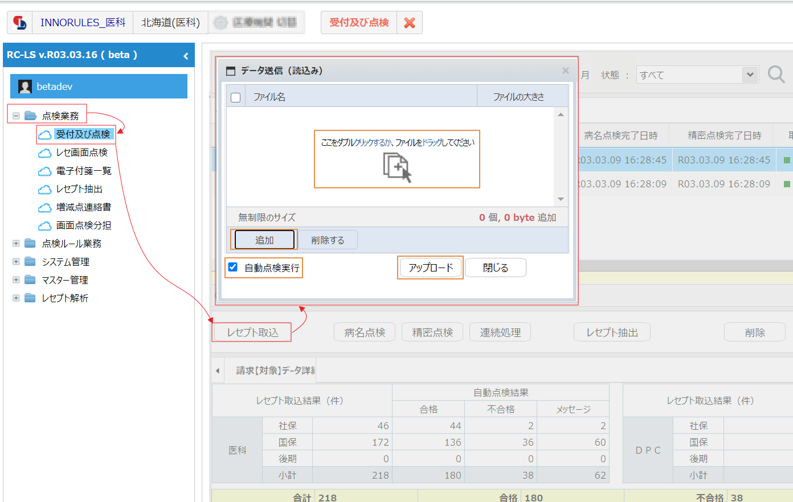

# 基本操作編



## レセプトの準備

直近の電子レセプトを準備します。複数の過去レセプトがあればより望ましいです。 院内処方であれば提出済のレセプトを、院外処方の場合には処方箋の内容を含んだ チェック用のレセプトをUSBメモリーあるいはハードディスクなどにいれて用意し てください。

注：チェック用レセプトの作成法はレセコンのサポート業者にご相談ください。 レセコンの機種によってはチェック用レセプトが作成できない場合があります。

## Google Chrom ブラウザ   [ダウンロード](https://www.google.co.jp/chrome/?brand=FDKM&gclid=Cj0KCQjwrsGCBhD1ARIsALILBYr0Moo0gPVqjheS9amL9joYxGxDtFBIwvu4vhcHOzXMZCSC0bZjH-AaAmjkEALw_wcB&gclsrc=aw.ds)

## ログイン　[https://owlstart.owl-checker.com/login](https://owlstart.owl-checker.com/login)

ID、パスワードを入力して、［Login］をクリックします。

### レセプト取込

左側のナビゲーションウィンドウの \[📂点検業務 \]  \[☁受付及び点検\] をダブルクリックします。  
\[レセプト取込\] をクリックしして\[追加\] をクリックします。  
取込むレセプトを選択する画面が表示されますので、点検する電子レセプト （RECEIPTC.UKE）を指定します。

アップロードに続いて、レセプト取込、自動点検が実行されます。 自動点検は病名点検、精密点検を連続して行う作業です。 自動点検が終わると結果が表示されます。

