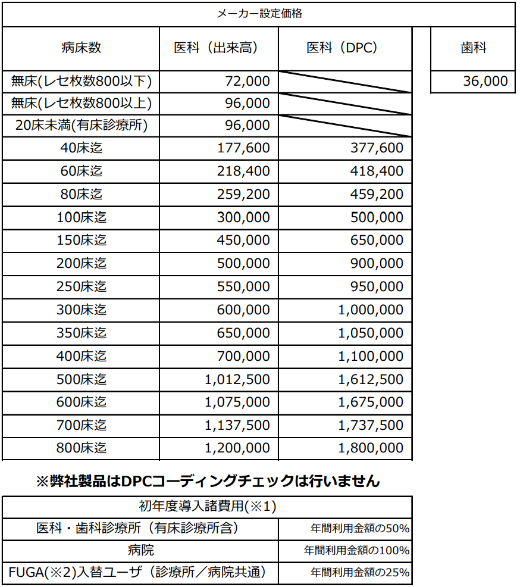

# 使用料金

１．供給地域及び対象：地域は日本国内とし、対象は保険医療機関です   
２．契約締結した顧客様より年間利用料としてお支払頂いた後、ご紹介料としてお支払い致します   
３．取次店様へのご紹介料は導入初回時と継続利用料お支払い時1回、最大2回のお支払いとさせていた　　  
　　だきます   
４．導入初年度は、上記金額と別に初年度導入諸費用（※１）が必要です   
５．上記価格は年間利用料金です、継続利用の場合、同額の継続利用料（1年更新）をお支払を頂きます。 また、年の途中で解約した場合に返金はされません   
６．提供サービスの開始：クラウド製品の為、医療機関ID／初回パスワードの付与にてサービスの開始  
　　と致します   
※1 「初年度導入諸費用」： 基本情報設定／ルール設定／オペレーションガイド\(操作説明書\)のご提供   
※2 レセプトチェッカーFUGA ： [https://receipt-checker.jp/](https://receipt-checker.jp/) レセプトチェッカーLSインストール版として  
       名称変更致します。

